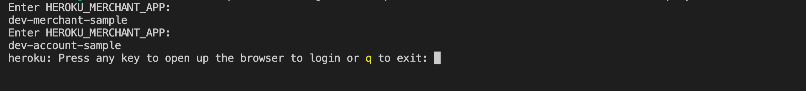

# End-to-end account & merchant sample

A sample to demonstrate end to end integration between ****Merchants & Accounts****

## Prerequisites and setup

* [Docker](https://www.docker.com/products/overview) - Ensure Docker is running on your computer
* [Docker Compose](https://docs.docker.com/compose/overview/) - v2.2.3 or higher
* [Node.js](https://nodejs.org/en/) v16.0.0 or higher
* [jq](https://stedolan.github.io/jq/) 1.6 or higher
* [cURL](https://curl.se/download.html)

## Prepare your Env file

Create **.env** file in root of this folder, according to your input Account/Merchant credential - you can check the .sample.env file for more details

```shell
ACCOUNT_CLIENT_ID=<your account client id credential>
ACCOUNT_CLIENT_SECRET=<your account client secret credential>
MERCHANT_CLIENT_ID=<your merchant client id credential, must be the merchant of your account>
MERCHANT_CLIENT_SECRET=<your merchant client secret credential, must be the merchant of your account >
PAYMENT_METHODS=<your account slug>
```

**Note:**

* Merchant credential could be found in your Open Fabric Portal

*Some additional config value if you want to try ***PGToken Flow****

```shell
PAYMENT_GATEWAY_PUBLISH_KEY=<Your merchant PG publish key>
PAYMENT_GATEWAY_NAME=<your merchant PG name, e.g: Xendit>
```
## Running sample on local

Make sure you done [this](#prepare-your-env-file)

```shell
sh start.sh
```

or if you already setup your own account server

```shell
sh start.sh -s
```

* Without specifying any parameter, we will:
  * use ngrok to proxy a public endpoint from running sample account docker
  * update new public endpoint to account settings
* By using `-s` you can skip this step and using your own configuration account server

Open <http://localhost:3000> on your browser and experience is ready to use.

For more details, this is our scenario:

* Orchestrated flow
  * [http://localhost:3000/orchestrated/vanilla](http://localhost:3000/orchestrated/vanilla) for the vanilla JS application
  * [http://localhost:3000/orchestrated/pg-sample](http://localhost:3000/orchestrated/pg-sample) for the Payment Gateway sample application (only valid if you input config value for this flow)
  * [http://localhost:3000/orchestrated/backend-sample](http://localhost:3000/orchestrated/backend-sample) for the Backend flow application
* Embedded Flow
  * [http://localhost:3000/embedded/checkout](http://localhost:3000/embedded/checkout) for the EmbeddedFlow

## Deploy to Heroku

You must have a Heroku account and the Heroku CLI installed.

* [Heroku CLI](https://devcenter.heroku.com/articles/heroku-cli)

##### Step 1: Prepare 2 apps

Before you can deploy samples to Heroku, prepare 2 new apps on your heroku account

* Merchant sample

    ```shell
        heroku apps:create <your merchant app name>
    ```

* Account sample

    ```shell
        heroku apps:create <your account app name>
    ```

##### Step 2: Make sure you done [this](#prepare-your-env-file)

##### Step 3: Run heroku deploy script

```shell
sh heroku-deploy.sh
```

You will be asked to input

* HEROKU_MERCHANT_APP: input your merchant app name
* HEROKU_ACCOUNT_APP: input your account app name
* Promt to heroku login 



After deploy scripts finished, our sample is ready to try on heroku

## Structure

* [x] merchant-integation-sample:
  * Demonstrate how to use our **MerchantSDK**
    * [Vanilla sample](merchant-integration-sample/public/vanilla.html)
    * [PG Flow Sample](merchant-integration-sample/components/PGSample.tsx)
    * [BE Flow Sample](merchant-integration-samples/frontend-sample/src/BackendSample.tsx)
* [x] account-integration-sample
  * [Authenticate with OF by using Account Client Credential](account-integration-sample/services/auth.js)
  * Orchestrated Flow
    * [Receive request create Transaction from OF system](account-integration-sample/services/of-transactions/createTransaction.js)
    * [Approve Transaction: Notify OF system](account-integration-sample/services/of-transactions/approveTransaction.js)
    * [Cancel Transaction: Notify OF system](account-integration-sample/services/of-transactions/cancelTransaction.js)
  * Embedded Flow
    * [Submit + Approve Transaction to OF](account-integration-sample/services/of-transactions/createTransactions_embedded.js)
  * [Webhook to receive notification from OF system](account-integration-sample/controllers/notificationWebhook/api.controller.js)
